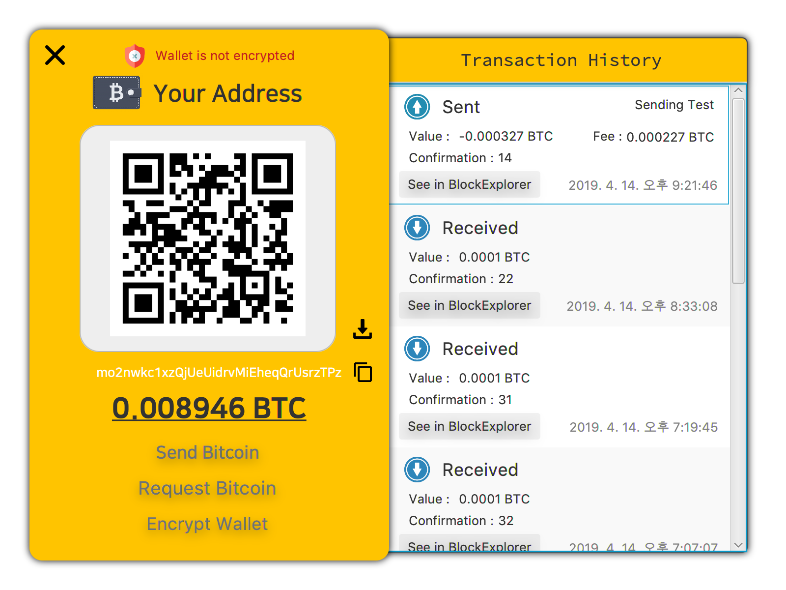
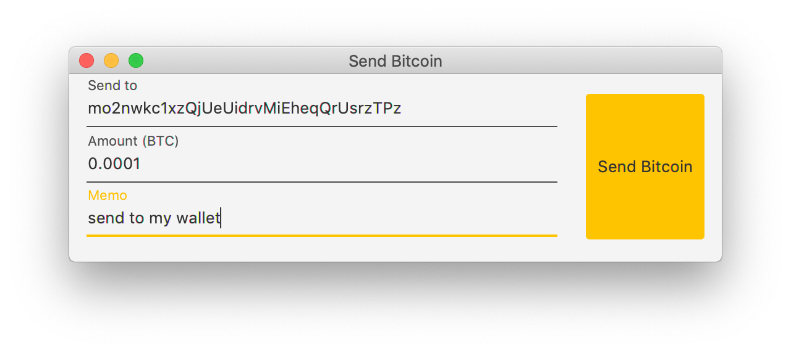
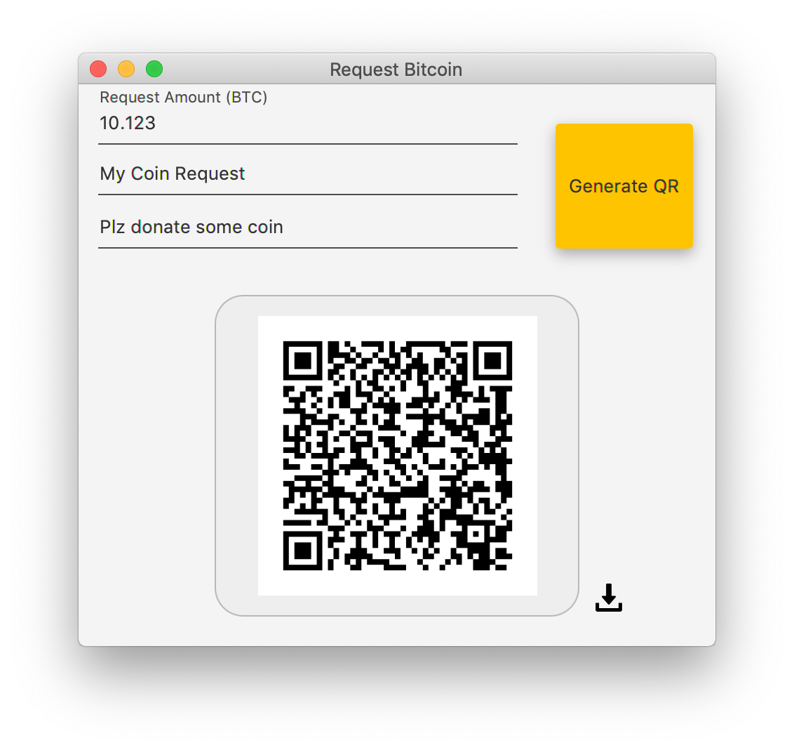

# Simple BitcoinJ GUI Wallet

> Simple bitcoin GUI wallet using [BitcoinJ](https://bitcoinj.github.io) library. 

> Configured to testnet environment.


# Requirements

* JDK >= 11
* Gradle >= 4.0.0

# Getting Started

**Using Gradle**

```shell
$ git clone https://github.com/LunaTK/Simple-Bitcoinj-GUI-Wallet.git
$ cd Simple-Bitcoinj-GUI-Wallet
$ ./gradlew run
```

# Screenshots





# License

[MIT](LICENSE)